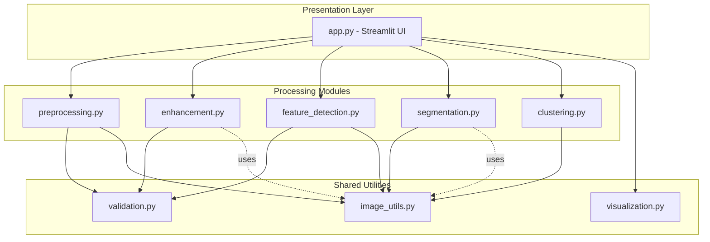
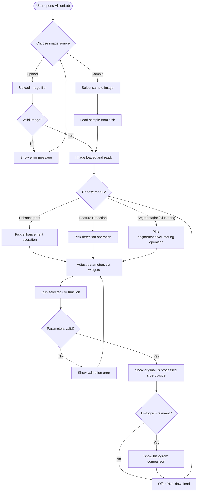
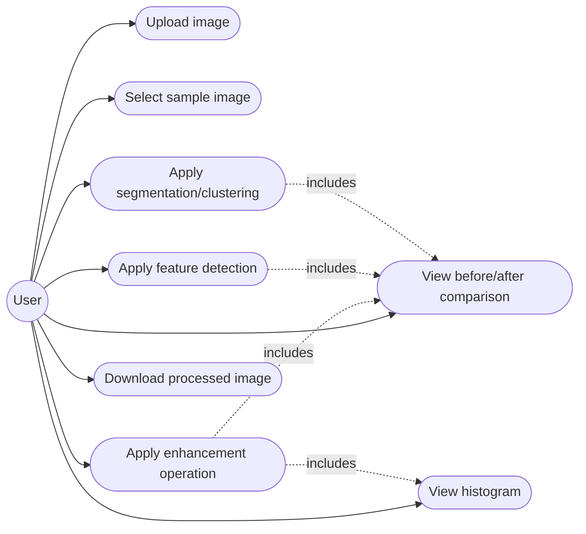
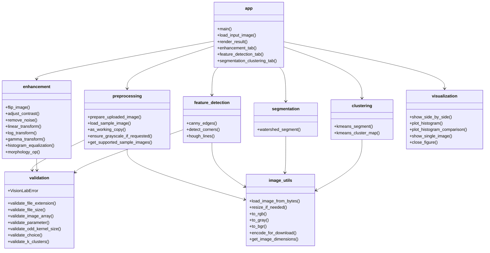
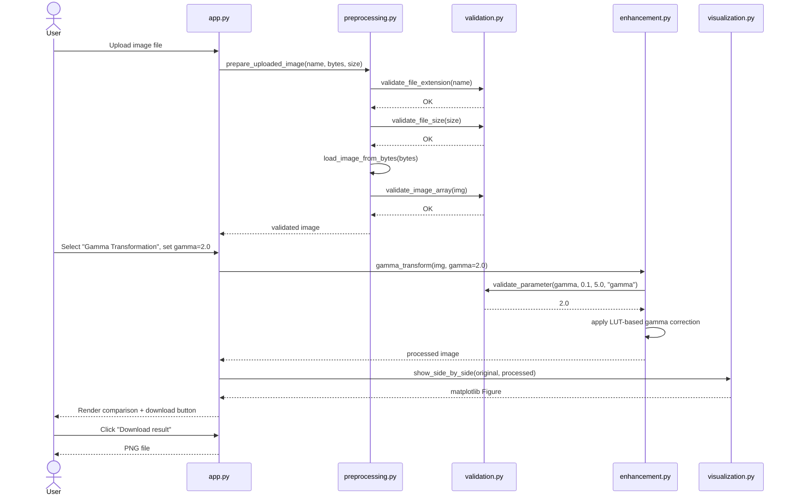

# VisionLab — Design Diagrams

This document contains the design artefacts required by the VITyarthi project guidelines: System Architecture, Process Flow/Workflow, Use Case, Class/Component, and Sequence diagrams. All diagrams are written in Mermaid syntax, which renders natively on GitHub and most Markdown viewers.

No database/ER diagram is included, as VisionLab uses no persistent storage — all processing happens in memory on the uploaded image.

## 1. System Architecture Diagram

Shows the high-level layering of the application: the Streamlit UI layer, the CV processing modules, and the shared utility layer.

## 2. Process Flow / Workflow Diagram

Shows the end-to-end user journey from opening the app to downloading a result.

## 3. Use Case Diagram

## 4. Class / Component Diagram

Represents the module-level components and their key functions (VisionLab is written as a functional module library rather than an OOP class hierarchy, so this diagram shows components/functions grouped by module).

## 5. Sequence Diagram — Applying an Enhancement Operation

Illustrates the interaction sequence when a user applies, for example, gamma transformation to their uploaded image.

